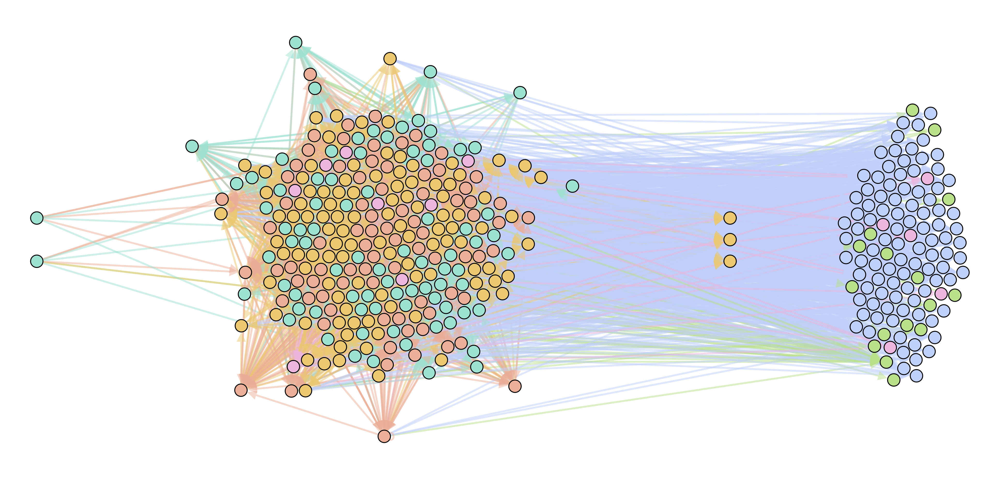

# SoftWired-Celegans
Code for the paper *Soft-wired long-term memory in a natural recurrent neuronal network* ([arXiv:2004.00498
](https://arxiv.org/abs/2004.00498), [bioRxiv 2020.04.01.020180](https://www.biorxiv.org/content/10.1101/2020.04.01.020180v1.abstract)).

    

#### AlgorithmOutput

Optimal network found by the genetic algorithm. 

#### Connectome

Connectome from [Whole-animal connectomes of both Caenorhabditis elegans sexes](https://www.nature.com/articles/s41586-019-1352-7) in `xls ` files. The directory also includes the code for the pruning and *Gephi* files for <u>figure 1a</u>.

#### Figures

- **FinalFigures:** Different figures of the paper in `pdf`.
- **ProgrammingFigures:** `ipynb` files for plotting the figures.

#### GeneticAlgorithm

Source files for running the genetic algorithm specified in section III. The main file is `genetic.m`, which can be run directly from the command window in `MATLAB`. 

#### Pentropy

Necessary files to compute permutation pentropy in <u>figure 3b</u>.  The main file is `mainPentropy.m`, which calls `petropy.m` from [Practical considerations of permutation entropy: A tutorial review](https://link.springer.com/article/10.1140/epjst/e2013-01862-7).

#### Rdistribution

`Python` code to generate different R distributions in <u>figure 6d</u>.

#### StatisticalTest

Chi squared test to compare distributions in <u>figure 5b</u>.

